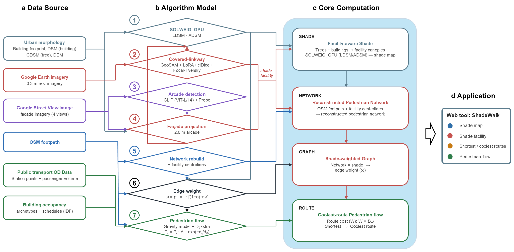

# ShadeWalk

[](https://doi.org/10.5281/zenodo.22688709)

Code for **ShadeWalk**: city-scale mapping of artificial shade facilities (arcades / five-foot ways and covered
linkways), facility-aware hourly shadow modelling, reconstruction of a shade-aware pedestrian network, and
coolest-route pedestrian-flow mapping for Singapore (with Bologna as a second study city for the arcade detector).



*Full method workflow. Data sources (left) feed seven algorithms (middle) that produce the three core computations
(shade, network, graph / route) behind the ShadeWalk web tool (right). Vector version: `docs/core_workflow.svg`.*

## Repository layout

One folder per module, numbered in pipeline order, plus `docs/` (workflow figure, software environments)
and `PROVENANCE.md` (origin of every file). Code is kept in this repository; the input datasets are distributed
through the figshare data record of the paper (https://doi.org/10.6084/m9.figshare.33549025, see the `INPUT_DATA.md` files).

## Modules

| Folder | Algorithm in the workflow figure | What it does | Environment |
|---|---|---|---|
| [`1_SOLWEIG_GPU (ADSM LDSM)`](<1_SOLWEIG_GPU (ADSM LDSM)/README.md>) | 1 SOLWEIG_GPU (LDSM, ADSM) | GPU shadow model (fork of SOLWEIG-GPU v1.2.21) extended with covered-linkway (LDSM) and arcade (ADSM / ADSMB) shading layers and a 13-class hourly shadow category | B |
| [`2_Covered Linkway Extraction`](<2_Covered Linkway Extraction/README.md>) | 2 Covered-linkway (GeoSAM + LoRA + clDice + Focal-Tversky) | Segmentation of covered-linkway roofs from 0.3 m satellite imagery; includes the annotated training dataset (1,111 tiles) and the trained lean checkpoint | C |
| [`3_Arcade Extraction and Projection/a_GSV Image Arcade Detection`](<3_Arcade Extraction and Projection/a_GSV Image Arcade Detection/README.md>) | 3 Arcade detection (CLIP ViT-L/14 + probe) | Detection of arcades in street-view images with CLIP embeddings and linear probes; includes the probes and their training labels | B |
| [`3_Arcade Extraction and Projection/b_Arcade Projection to Building Footprint`](<3_Arcade Extraction and Projection/b_Arcade Projection to Building Footprint/README.md>) | 4 Facade projection (1.5-3 m arcade) | Ray-casting projection of positive views onto street-facing facades, edge-based arcade decision, 2 m / 3 m arcade strips and remaining building footprints | A |
| [`5_OSM Network Reconstruction`](<5_OSM Network Reconstruction/README.md>) | 5 Network rebuild (+ facility centrelines) | Insertion of arcade and linkway centrelines into the OSM pedestrian network with rule-based cleaning and connection | A |
| [`4_Pedestrian Flow Mapping/a_OD Coolest-Route Algorithm (Route Cost Calculation)`](<4_Pedestrian Flow Mapping/a_OD Coolest-Route Algorithm (Route Cost Calculation)/README.md>) | 6 Routing cost (rho = (1 - sigma) + lambda) | Per-edge shade, shortest vs coolest routing, lambda / detour sensitivity, station-anchored flows; generators and English build of the ShadeWalk web tool | A |
| [`4_Pedestrian Flow Mapping/b_Pedestrian OD Flow Assignment (Gravity and Huff model)`](<4_Pedestrian Flow Mapping/b_Pedestrian OD Flow Assignment (Gravity and Huff model)/README.md>) | 7 Pedestrian flow (gravity OD, Huff, Dijkstra) | madina patronage betweenness: hourly transit ridership distributed to buildings weighted by floor area and occupancy schedules | A |

Environments A (GIS, Python 3.11), B (QGIS Python 3.12 with torch) and C (conda `sam2`, Python 3.10) are
specified in [`docs/ENVIRONMENTS.md`](docs/ENVIRONMENTS.md).

## Data flow between the modules

```
Module 2  covered_linkway_SG_island_tv_pednet_bridged.gpkg ─┬─> Module 1 (LDSM raster)
                                                            └─> Module 5 (linkway centrelines)
Module 3a arcade-positive views ──> Module 3b ─┬─ step2_arcade_sg.gpkg, step2_building_remain_sg.gpkg ──> Module 1 (ADSM, ADSMB, DSMremain, BREMAIN)
                                              └─ step2b_runs_sg.gpkg, step2_arcade_sg.gpkg ──────────────> Module 5 (arcade centrelines)
Module 4b station_hourly_ridership.gpkg, building_hourly_weight.gpkg, pedestrian_network_filtered.gpkg ──> Modules 4a, 5, 2
Module 1  Shadow_2pm_h14.tif, Category_2pm_h14.tif (and 24-band rasters) ──> Module 4a (edge shade) and the web tool
Module 5  step4_network_final.gpkg ──> Module 4a (routing graph)
```

Every module folder contains a `README.md` (method, scripts, parameters, commands, results) and an
`INPUT_DATA.md` (complete inventory of inputs with format, CRS, source and the script that consumes them).

## Data sources

All input data of the pipeline come from open or documented providers. The files marked figshare are part of the
data record https://doi.org/10.6084/m9.figshare.33549025 (folder / file names as in the record); the module column
refers to the folders above, and the `INPUT_DATA.md` of each module gives the full specification.

| Data | What is used | Provider and licence | Module | Where to get it |
|---|---|---|---|---|
| Building footprints with height, storeys and function | 118,782 footprints of Singapore with building height, storeys, archetype (function class) and gross floor area; island boundary (14 polygons) | City Syntax Lab building dataset (OpenStreetMap footprints; heights and functions compiled by the lab). CC BY 4.0; footprints (c) OpenStreetMap contributors (ODbL) | 1 (building DSM via module 3b), 2 (exclusion mask), 3a / 3b (arcade projection), 4a / 4b (destination weights) | figshare `5_base_data/SG_buildings_footprint_height_function.zip`, `SG_island_boundary.zip` |
| Tree-canopy height | Meta 1 m global canopy height map, clipped to Singapore (canopy height above ground) | Meta / WRI global canopy height maps (Tolan et al., 2024), CC BY 4.0 | 1 (CDSM, vegetation shadow) | figshare `1_shadow_model_rasters/SG_CDSM_tree_1m.tif` |
| Terrain | ALOS PALSAR radiometrically terrain-corrected DEM (12.5 m), resampled to the 1 m city grid | JAXA / METI ALOS PALSAR, distributed by ASF DAAC (free with attribution) | 1 (DEM) | figshare `1_shadow_model_rasters/SG_DEM_1m.tif` |
| Satellite imagery, 0.3 m | Google Earth imagery mosaicked to SVY21; 1,111 annotated 1024 px training tiles (808 train / 303 validation) | Google (terms of use; tiles provided for research reproducibility only) | 2 (covered-linkway extraction) | training tiles: figshare `2_covered_linkway`; the island mosaic is not redistributed |
| Street-level imagery, four views per point | Four perspective views per panorama point every 20 m along the road network (about 148,850 points in Singapore, 71,900 in Bologna) | Google Street View Static API (Google terms of use; images not redistributed) | 3a (arcade detection), 3b (projection onto building footprints) | https://developers.google.com/maps/documentation/streetview/overview (also in figshare `3_arcade.txt`); detection probes, labels and sampling conventions are in module 3a |
| Pedestrian network | OpenStreetMap `highway` extract of Singapore (June 2026), cleaned to 404,613 pedestrian-passable segments | OpenStreetMap contributors, ODbL | 5 (network reconstruction), 4b (flow model), 2 (network filter) | figshare `5_base_data/SG_osm_lines.gpkg` |
| Public transport: stops, stations and passenger volumes | Bus stop locations (Aug 2025), MRT / LRT stations (Aug 2025) and station exits (Feb 2025); monthly passenger volumes by bus stop and train station and by origin-destination (hourly tap-in / tap-out) | Land Transport Authority of Singapore, LTA DataMall, Singapore Open Data Licence | 4b (demand origins; 4a uses its station-ridership export) | locations: figshare `4_OD_flow/Station_Location.zip`; volumes: https://datamall.lta.gov.sg/content/datamall/en/dynamic-data.html (also in figshare `4_OD_flow.txt`) |
| Building occupancy schedules | 20 EnergyPlus archetype models (SGP 2025 V5): people per floor area and hourly occupancy schedules per building type | Singapore building-archetype models (SGP 2025 V5) | 4b (hourly destination weights of the gravity model; 4a uses its building-weight export) | figshare `4_OD_flow/AllArhcetypes_SGP_2025_V5.zip` |
| Meteorological forcing | Hourly UMEP-format forcing of station S50 (Clementi Road): 2026-03-01 (paper run) and the four equinox / solstice days | Meteorological Service Singapore | 1 (shadow model) | this repository, `1_SOLWEIG_GPU (ADSM LDSM)/sample_data/forcing` |

## What is and is not in this repository

Included: all pipeline code, the modified SOLWEIG-GPU package with a patch against upstream, the covered-linkway
training annotations (LabelMe polygons, masks, tile grid), the arcade-probe models and their label files, the
trained covered-linkway checkpoint (27 MB), the English build of the web tool (gzip), the meteorological forcing
files, and the documentation.

Not included (size or licence): raw imagery (Google satellite basemap tiles, Google Street View images), the
city-wide 1 m rasters (DEM, canopy, building DSM, 24-band shadow / category outputs), LTA and OSM source layers,
the SAM ViT-H weights, and the derived vector / raster products of each module. Their sources and specifications
are listed in the `INPUT_DATA.md` files. The input layers (shadow-model rasters, covered-linkway training tiles,
transit and building layers, cleaned OSM lines) are released in the figshare data record accompanying the paper
(https://doi.org/10.6084/m9.figshare.33549025);
the derived products are regenerated from them with this code and are available from the corresponding author on request.

## Running the code

The scripts are the ones that produced the results of the paper and keep the absolute paths of the original
workstation in the constants at the top of each file (`ROOT`, `OUT`, `BASE`, `TIF`, ...). Edit those constants to
your data layout before running; the module READMEs give the run order and the expected run times. Third-party
models are downloaded as described in `docs/ENVIRONMENTS.md`.

Verification performed on the released code (2026-09-10, on the original workstation):

| Module | Test | Result |
|---|---|---|
| 1 | test-area run (4000 x 3974 px, 24 h) with the repository package | reproduces the reference Category / Shadow rasters bit-for-bit (24 / 24 bands each), 115 s per tile |
| 2 | inference + vectorise + pedestrian-network filter on the 4 km AOI; one training epoch of the final trainer | 225 tiles in 0.6 min, 99.8 % pixel agreement with the published island product in that window; training epoch completes in 9 min (val Dice 0.59 after one epoch) |
| 3a | detection smoke run (150 Tier-1 panoramas) | identical to the production detections: 407 positive views, Jaccard 1.000, max probability difference 0.0 |
| 3b | full Singapore projection chain (project -> edge decision -> buffer / split) | identical to the published vectors: 28,415 points, 18,032 segments, 7,219 runs, 10,076 arcade strips, 103,112 remaining buildings, same areas and lengths |
| 4a | network preparation and per-edge shade (469,434 edges) | graph identical (components, u / v); shade values identical on 99.1 % of edges, the remaining 0.9 % differ because the shadow rasters on disk post-date the June production run (arcade update) |
| 4b | single-pass madina model on the CBD smoke bounding box (6 x 6.5 km), one hour slot | runs end-to-end in 1.3 min: 15,582 edges, 756 origins, 13,400 destinations, flow on 2,738 edges (p99 298, max 2,390 pedestrians) |
| 5 | full Singapore network reconstruction chain (6 stages) | identical to the published layers at every stage: 15,873 / 16,467 / 404,613 / 400,151 / 459,646 / 469,434 segments, same source composition and segment lengths |

All Python scripts were checked to be syntactically valid and, except for the path adaptations listed in
`PROVENANCE.md`, to be identical in logic to the scripts that generated the published results (abstract-syntax-tree
comparison with string constants masked; comments, docstrings and messages were translated to English).

## Citation and archived versions

The code is archived on Zenodo. The concept DOI [10.5281/zenodo.22688709](https://doi.org/10.5281/zenodo.22688709) always resolves to the
latest version; each release also has its own version DOI:

| Release | Tag | Version DOI | Content |
|---|---|---|---|
| 1.0.0 (2026-09-10) | `v1.0.0` | [10.5281/zenodo.22688710](https://doi.org/10.5281/zenodo.22688710) | first public release |
| 1.0.1 (2026-09-11) | `v1.0.1` | [10.5281/zenodo.22694699](https://doi.org/10.5281/zenodo.22694699) | documentation update: open-data source descriptions, links to the figshare data record, input-only data-record wording |
| 1.0.2 (2026-09-12) | `v1.0.2` | [10.5281/zenodo.22725730](https://doi.org/10.5281/zenodo.22725730) | documentation update: version DOIs, author ORCID and affiliation, precise building-layer provenance, open-data wording for Master Plan layers, extended data-availability statement, updated workflow figure |

The input data are archived on figshare: [10.6084/m9.figshare.33549025](https://doi.org/10.6084/m9.figshare.33549025) (the DOI without a `.vN` suffix
always resolves to the latest version of the data record).

Suggested availability statements (cite the version DOI of the release used for the paper):

> Code availability: The code of the ShadeWalk pipeline (shade-facility extraction, facility-aware SOLWEIG-GPU
> shadow modelling, pedestrian-network reconstruction and coolest-route pedestrian-flow mapping) is openly available
> at https://github.com/Shawnzhang7829/ShadeWalk and archived on Zenodo (https://doi.org/10.5281/zenodo.22688709; version 1.0.2).
>
> Data availability: The input datasets of the ShadeWalk pipeline (shadow-model rasters, covered-linkway training
> tiles, transit and building layers) are available on figshare (https://doi.org/10.6084/m9.figshare.33549025).
> The street-level images used for arcade detection were obtained through the Google Street View Static API
> (https://developers.google.com/maps/documentation/streetview/overview) and cannot be redistributed under Google's
> terms of use; the detection probes, their training labels and the sampling conventions are included in the code
> repository. The monthly passenger volumes by bus stop and train station and by origin-destination used for the
> pedestrian-flow model are published by the Land Transport Authority of Singapore on LTA DataMall
> (https://datamall.lta.gov.sg/content/datamall/en/dynamic-data.html) under the Singapore Open Data Licence.
> Derived products (hourly shadow rasters, covered-linkway polygons, arcade vectors, the reconstructed pedestrian
> network and pedestrian flows) can be regenerated with the code and are available from the corresponding author
> on request.

Please cite the ShadeWalk paper (reference to be added on publication) and this repository (`CITATION.cff`).
The shadow engine builds on SOLWEIG-GPU (Kamath et al., 2026, JOSS) and SOLWEIG (Lindberg et al., 2008); the flow
model on madina (Alhassan and Sevtsuk, 2024); the segmentation model on Segment Anything, GeoSAM and clDice; the
arcade detector on CLIP.

## Licence

MIT for the ShadeWalk code (see `LICENSE`). `1_SOLWEIG_GPU (ADSM LDSM)` is a derivative of SOLWEIG-GPU and is
GPL-3.0 (see the `LICENSE` file in that folder). Third-party components keep their own licences (Apache-2.0 for
Segment Anything / SAM 2, MIT for GeoSAM, clDice, CLIP and madina).
